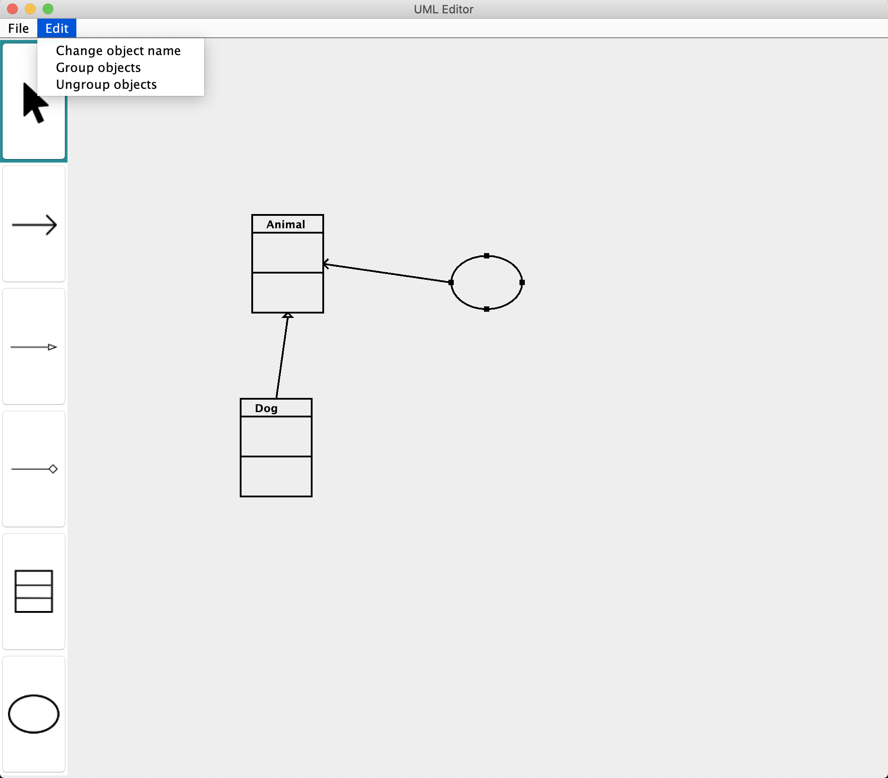
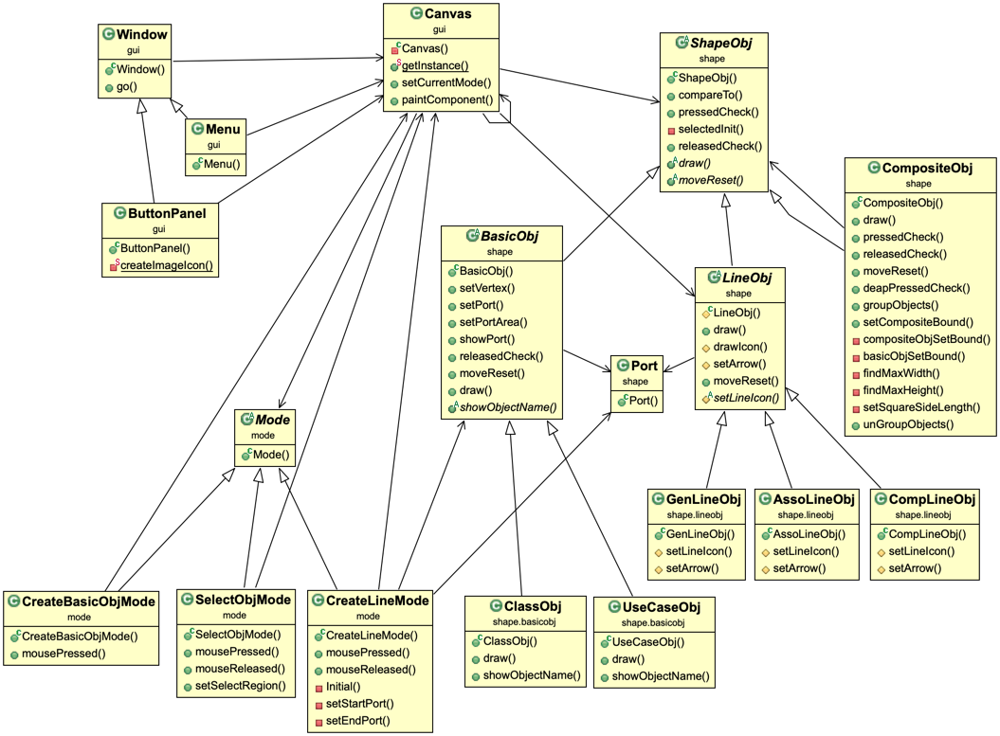

# Unified Modeling Language (UML) Editor
A UML class diagram can be used to express the structure of a system by showing the relationship among objects. And a UML editor is a tool to make drawing a UML class diagram efficiently.

## Table of Contents
* [Introduction](#introduction)
* [Technologies](#technologies)
* [Setup](#setup)
* [Features](#features)
* [Class Diagram](#class-diagram)

## Introduction

A UML Editor is in the window which is composed of a **menu bar** on the top, a list of **buttons** on the left, and a **canvas** on the rest of the window.
*   Buttons

Six buttons from top to bottom is select, association line, generalization line, composition line, class object, and use case object
*   Menu bar

Other features in the Edit menu included group objects, ungroup object and change the object’s name
*   Canvas

A place for drawing objects and lines.
*   Other definition 
    * basic object: class object or use case object
    * object: composite object or basic object
    * composite object: grouped objects
    * line: association line, generalization line, or composition line

## Technologies 
* OpenJDK 15.0.2

## Setup 
```
# change directory to src 
$ cd src

# generate and store the compiled class files in directory output
$ javac gui/Main.java -d output

# change directory to output
$ cd output

# excecute
$ java gui/Main
```

## Features
* **Create basic object mode**
    * Create a UML basic object
        * click on a basic object button (Class Object, Use Case Object)
        * click on the canvas to create a basic object
* **Create line mode**
    * Create a UML connection line
        * click on a line button (Association Line, Generalization Line, Composition Line)
        * press one basic object
        * drag continuously to another basic object and release
        * create a connection line from the first basic object to the second one
* **Select mode**
    * Select a single object
        * click on the select button
        * click on a single object
    * Select a group of objects
        * click on the select button
        * press a point that contains no objects
        * drag continuously to another point and release
        * the selected area where contains specific objects
    * Unselect a single object or a group of objects
        * click on the select button
        * click on a place where contains no objects
    * Group objects into a composite object
        * click on the select button
        * select a group of objects
        * click on Group Objects in the Edit menu
    * Ungroup a composite object into objects
        * click on the select button
        * select a composite object
        * click on Ungroup Object in the Edit menu
    * Move object
        * click on the select button
        * press one object or a group of objects
        * drag continuously to another point and release on where the object you want object/objects to be
        * automatically remove all connection lines which connected with the object
    * Change object name
        * click on the select button
        * select a single basic object
        * click on the change object name in the Edit menu
        * enter a new name for the basic object

## Class Diagram
